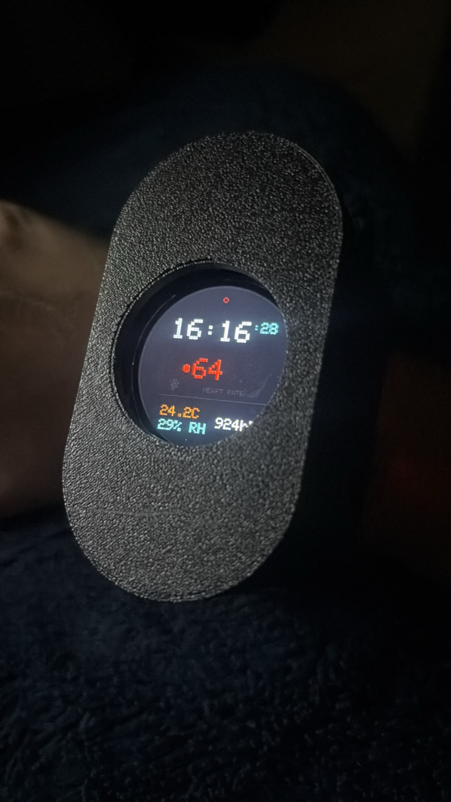
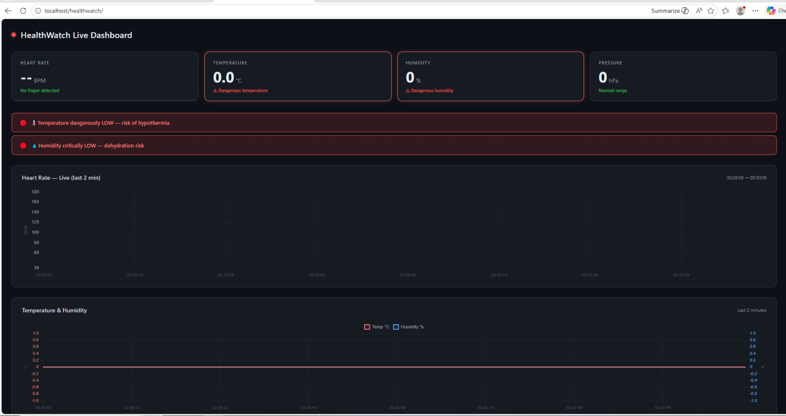
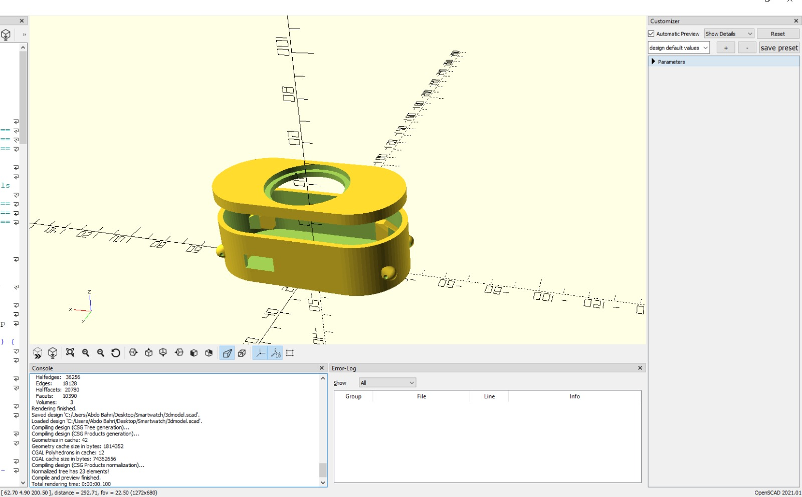
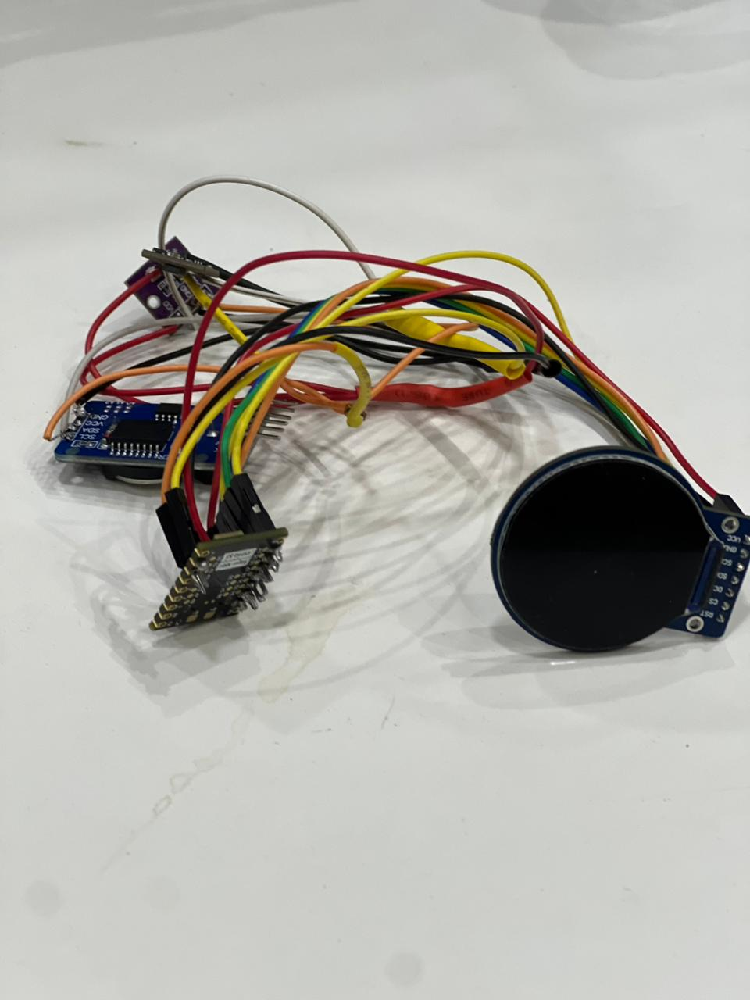

  <h1>⌚ Tactical Watch Pro (ESP32-S3)</h1>
  
<b>Senior Graduation Project | Department of Electronics Engineering — University of Tabuk</b>

  
An end-to-end, full-stack IoT smartwatch ecosystem engineered around the <b>ESP32-S3 SuperMini</b>. Combines embedded C++ firmware, real-time PPG biometric tracking, a 3D-printed parametric enclosure, and a web-based tele-health analytics dashboard.

<h2>📸 System Gallery</h2>

  <h3>Hardware Prototype & Analytics Dashboard</h3>

<table width="100%">
  <tr>
    <td align="center" width="50%">
      <h4>Physical Hardware Prototype</h4>
      
    </td>
    <td align="center" width="50%">
      <h4>Web UI Analytics Dashboard</h4>
      
    </td>
  </tr>
</table>

 

<table width="100%">
  <tr>
    <td align="center" width="50%">
      <h4>Parametric 3D CAD Design</h4>
      
    </td>
    <td align="center" width="50%">
      <h4>Soldered Circuit Assembly</h4>
      
    </td>
  </tr>
  <tr>
    <td align="center" colspan="2">
      <h4>Breadboard Prototype & Signal Testing</h4>
      
    </td>
  </tr>
</table>

<h2>🛠️ System Architecture & Subsystems</h2>

<table width="100%">
  <thead>
    <tr>
      <th align="left">Subsystem</th>
      <th align="left">Tech / Component</th>
      <th align="left">Engineering Description</th>
    </tr>
  </thead>
  <tbody>
    <tr>
      <td><b>MCU Firmware</b></td>
      <td>ESP32-S3 SuperMini</td>
      <td>Dual-Core Xtensa LX7 @ 240MHz, Wi-Fi 4 &amp; BLE 5.0, Custom C++ Application (<code>esp32s3_code.ino</code>)</td>
    </tr>
    <tr>
      <td><b>Web Dashboard</b></td>
      <td>PHP 8 &amp; JSON Engine</td>
      <td>Hosted tele-health telemetry platform (<code>htdocs/smartwatch/</code>) with RESTful API endpoints for telemetry ingestion</td>
    </tr>
    <tr>
      <td><b>Display UI</b></td>
      <td>GC9A01 LCD (SPI)</td>
      <td>1.28" Round IPS display driven with custom splashscreen header bitmap (<code>splashscreen240.h</code>)</td>
    </tr>
    <tr>
      <td><b>Biometrics</b></td>
      <td>MAX30105 PPG Sensor</td>
      <td>Optical Pulse Oximeter &amp; Heart Rate Sensor operating via I2C interface</td>
    </tr>
    <tr>
      <td><b>Mechanical CAD</b></td>
      <td>OpenSCAD Parametric</td>
      <td>Monolithic 3D capsule enclosure script (<code>smartwatch_full_assembly.scad</code>) with 22mm lug integration</td>
    </tr>
  </tbody>
</table>

<h2>🔌 Hardware Pinout Mapping</h2>

<h3>GC9A01 Display Interface (SPI)</h3>
<blockquote>
  <b>Design Note:</b> Display SPI data (MOSI) and reset (RST) lines utilize <b>GPIO 1</b> and <b>GPIO 2</b> to optimize internal physical trace routing away from the USB-C port while minimizing electrical crosstalk with the I2C bus lines.
</blockquote>

<table width="100%">
  <thead>
    <tr>
      <th align="left">GC9A01 Pin</th>
      <th align="left">ESP32-S3 Pin</th>
      <th align="left">Function</th>
      <th align="left">Signal Notes</th>
    </tr>
  </thead>
  <tbody>
    <tr>
      <td><b>SDA (MOSI)</b></td>
      <td><code>GPIO 1</code></td>
      <td>SPI Master Out Slave In</td>
      <td>Custom routed line</td>
    </tr>
    <tr>
      <td><b>RES (RST)</b></td>
      <td><code>GPIO 2</code></td>
      <td>Hardware Reset</td>
      <td>Strapping pin (Boot-safe)</td>
    </tr>
    <tr>
      <td><b>SCL (SCK)</b></td>
      <td><code>GPIO 12</code></td>
      <td>SPI Serial Clock</td>
      <td>Hardware SPI bus</td>
    </tr>
    <tr>
      <td><b>DC</b></td>
      <td><code>GPIO 9</code></td>
      <td>Data / Command Select</td>
      <td>Control line</td>
    </tr>
    <tr>
      <td><b>CS</b></td>
      <td><code>GPIO 13</code></td>
      <td>Chip Select</td>
      <td>Active LOW</td>
    </tr>
    <tr>
      <td><b>VCC / GND</b></td>
      <td><code>3.3V / GND</code></td>
      <td>Power Supply</td>
      <td>Onboard regulated line</td>
    </tr>
  </tbody>
</table>

 

<h3>MAX30105 Biometric Sensor (I2C)</h3>

<table width="100%">
  <thead>
    <tr>
      <th align="left">MAX30105 Pin</th>
      <th align="left">ESP32-S3 Pin</th>
      <th align="left">Function</th>
    </tr>
  </thead>
  <tbody>
    <tr>
      <td><b>SDA</b></td>
      <td><code>GPIO 8</code></td>
      <td>I2C Data Line</td>
    </tr>
    <tr>
      <td><b>SCL</b></td>
      <td><code>GPIO 9</code></td>
      <td>I2C Clock Line</td>
    </tr>
    <tr>
      <td><b>VIN / GND</b></td>
      <td><code>3.3V / GND</code></td>
      <td>Power Rails</td>
    </tr>
  </tbody>
</table>

<h2>💻 Firmware & Backend API Integration</h2>

The system pairs embedded firmware telemetry with a light server backend for real-time remote monitoring:

<ul>
  <li><b>Microcontroller Firmware:</b> Main application source compiled in <code>esp32s3_code.ino</code>, incorporating precompiled binary assets (<code>FIRMWARE.BIN</code>) and custom UI splash images (<code>splashscreen240.h</code>).</li>
  <li><b>Web API & Dashboard:</b> The <code>htdocs/smartwatch/</code> server stack features an active API worker (<code>api.php</code>) that receives PPG sensor payloads and persists state to <code>data.json</code> for visual display in <code>index.php</code>.</li>
</ul>

<h2>📂 Repository Structure</h2>

<pre><code>├── htdocs/
│   └── smartwatch/
│       ├── api.php                         # Telemetry ingestion endpoint
│       ├── data.json                       # Real-time health data storage
│       └── index.php                       # Web tele-health user interface
├── images/                                 # High-resolution documentation photos
│   ├── autoscad_3d.jpeg
│   ├── complete_assembled_project.jpeg
│   ├── dashboard.jpeg
│   ├── soldered_circuit.jpeg
│   └── test_board_circuit
├── esp32s3_code.ino                        # Primary ESP32-S3 Arduino C++ firmware
├── FIRMWARE.BIN                            # Compiled binary distribution file
├── smartwatch_full_assembly.scad           # OpenSCAD 3D printable parametric case script
├── splashscreen240.h                       # Custom 240x240 display splash bitmap array
└── README.md
</code></pre>

<h2>🎓 Academic Context</h2>

<table width="100%">
  <tr>
    <td width="25%"><b>Institution</b></td>
    <td><b>University of Tabuk</b></td>
  </tr>
  <tr>
    <td><b>Department</b></td>
    <td>Department of Electronics Engineering</td>
  </tr>
  <tr>
    <td><b>Project Type</b></td>
    <td>Senior Graduation Capstone Project</td>
  </tr>
</table>

